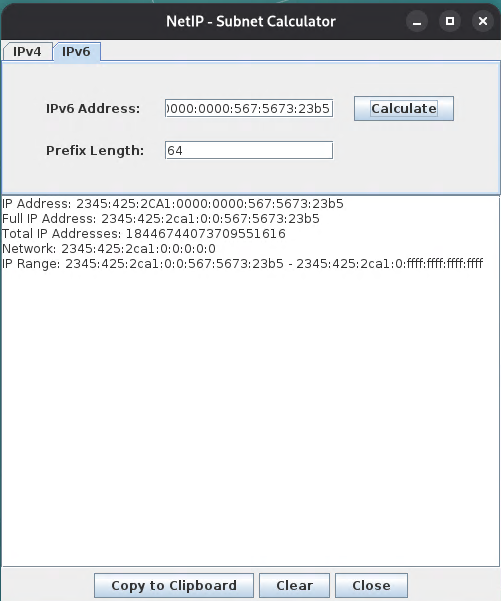

# NetIP - Subnet Calculator

NetIP is a simple and easy-to-use subnet calculator for both IPv4 and IPv6 addresses. It provides detailed information about a given IP address and subnet, helping network administrators and students to understand and manage their networks.

## Features

*   **IPv4 and IPv6 Support:** Calculate subnet information for both IPv4 and IPv6 addresses.
*   **Detailed Information:** Get a comprehensive breakdown of network details, including:
    *   **For IPv4:**
        *   Network Address
        *   Broadcast Address
        *   Usable Host IP Range
        *   Total and Usable Number of Hosts
        *   Subnet Mask
        *   Wildcard Mask
        *   Binary Subnet Mask
        *   IP Class (A, B, C, D, E)
        *   CIDR Notation
        *   Public or Private IP Type
    *   **For IPv6:**
        *   Total IP Addresses
        *   Network Address
        *   IP Range
        *   Full (unabbreviated) IP Address
*   **User-Friendly Interface:** A clean and intuitive graphical user interface (GUI) built with Java Swing.
*   **Convenient Tools:**
    *   Copy results to the clipboard.
    *   Quickly clear input fields.
    *   Select common IPv4 subnet masks from a dropdown.

## Screenshots




## How to Use

1.  **Launch the application.**
2.  **Select the appropriate tab for IPv4 or IPv6.**
3.  **Enter the IP address and subnet mask (for IPv4) or prefix length (for IPv6).**
4.  **Click the "Calculate" button.**
5.  **The results will be displayed in the text area.**

## Building from Source

To build the project from source, you will need to have the Java Development Kit (JDK) installed.

1.  **Clone the repository:**
    ```bash
    git clone https://github.com/Shawn-Falconbury/NetIP-Subnet-Calculator.git
    ```
2.  **Navigate to the project directory:**
    ```bash
    cd NetIP-Subnet-Calculator
    ```
3.  **Compile the source code:**
    ```bash
    javac src/*.java -d out
    ```
4.  **Run the application:**
    ```bash
    java -cp out NetIP
    ```

## Contributing

Contributions are welcome! If you have any ideas, suggestions, or bug reports, please open an issue or submit a pull request.

## License

This project is licensed under the MIT License - see the [LICENSE](LICENSE) file for details.
